# University Management System

A full-stack web application for managing university registration and administrative operations for the Lebanese University (Faculty of Science – Fanar branch).

---

## 👨‍🎓 Student Interface

### Home Page

  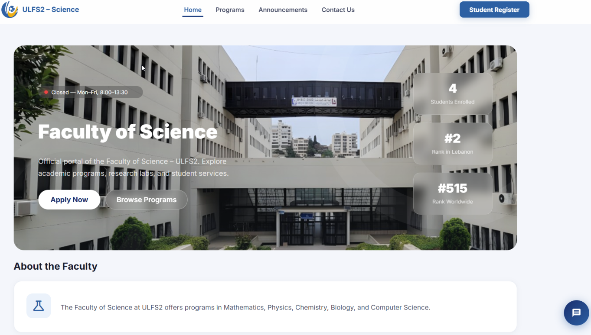

### Chatbot

  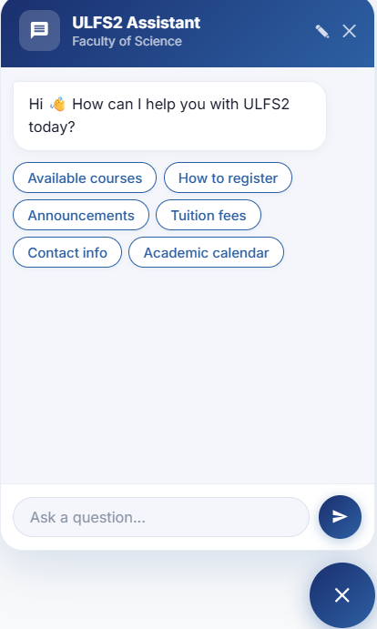

  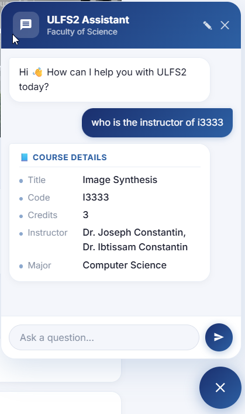

### Registration

  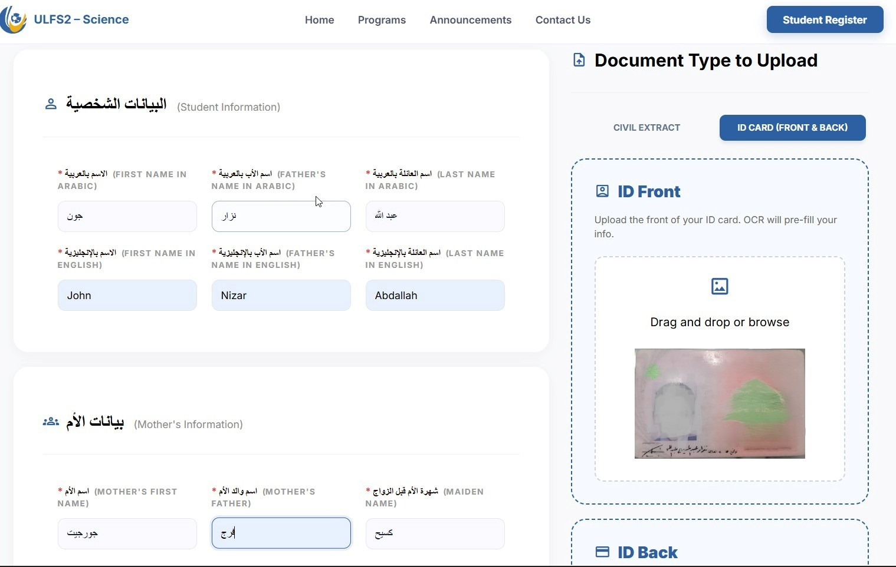

  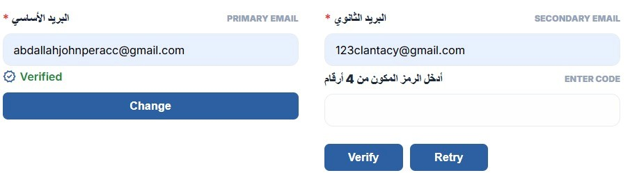

### Courses

  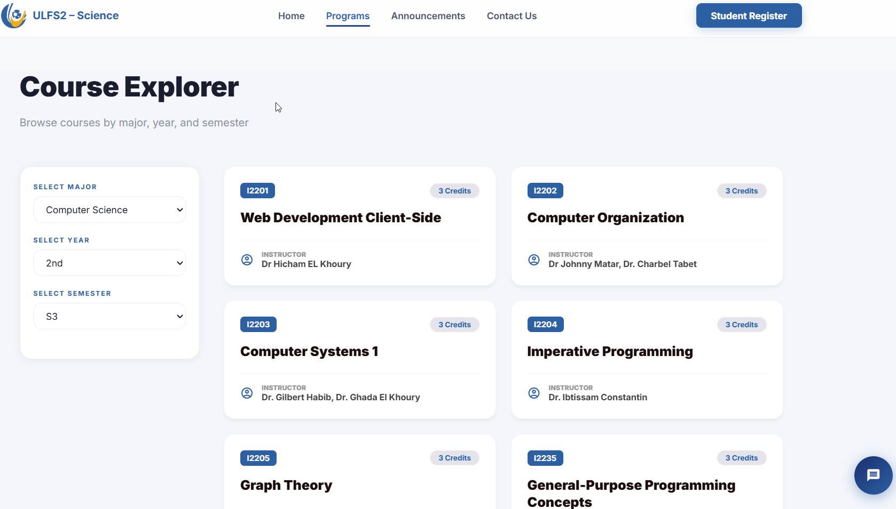

### Contact Us

  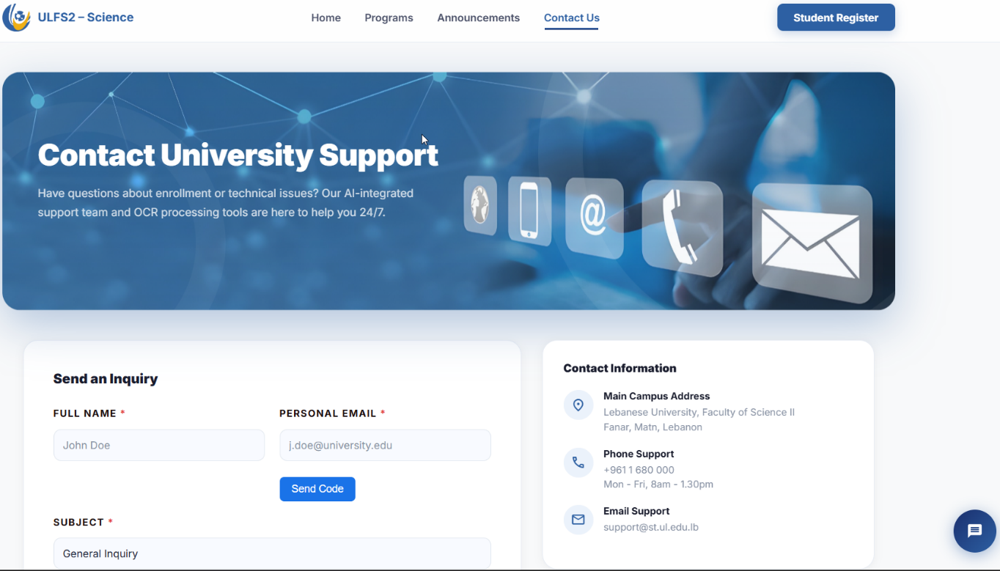

---

## 🛠️ Admin Interface

### Login & Dashboard

  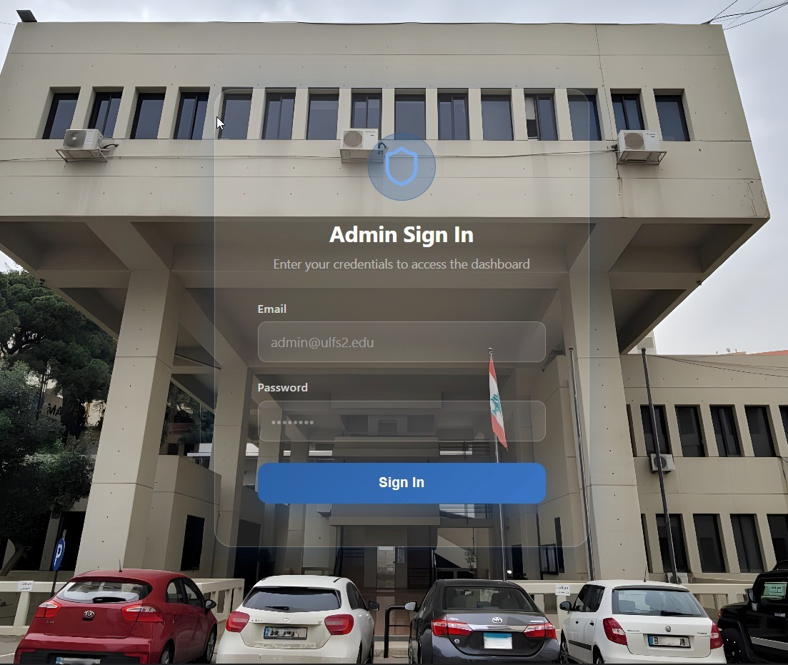

  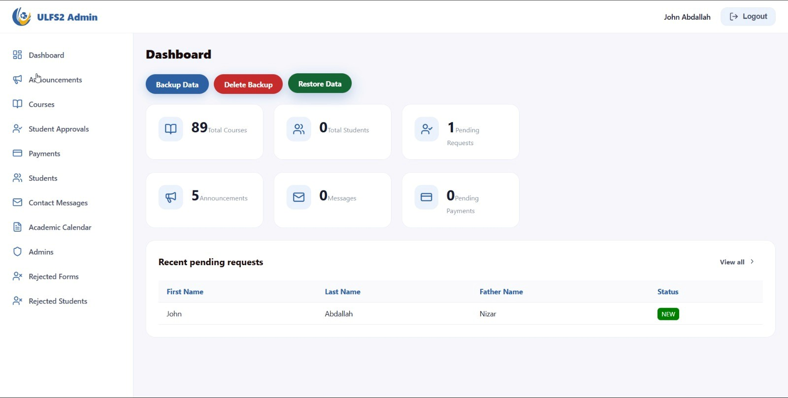

### Students

  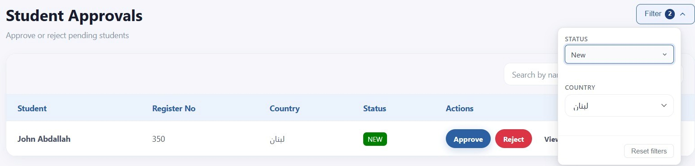

  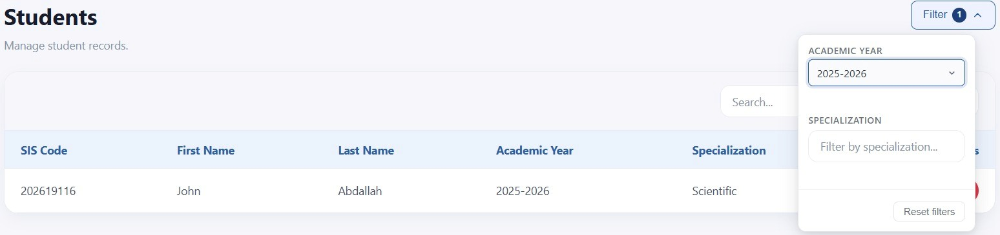

  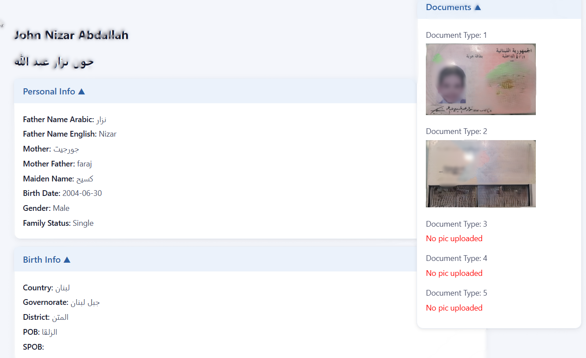

### Courses

  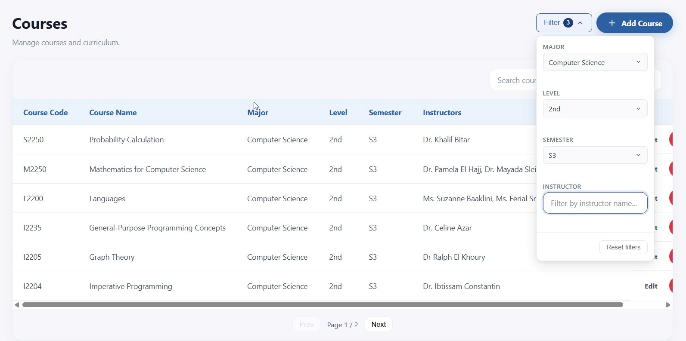

### Announcements

  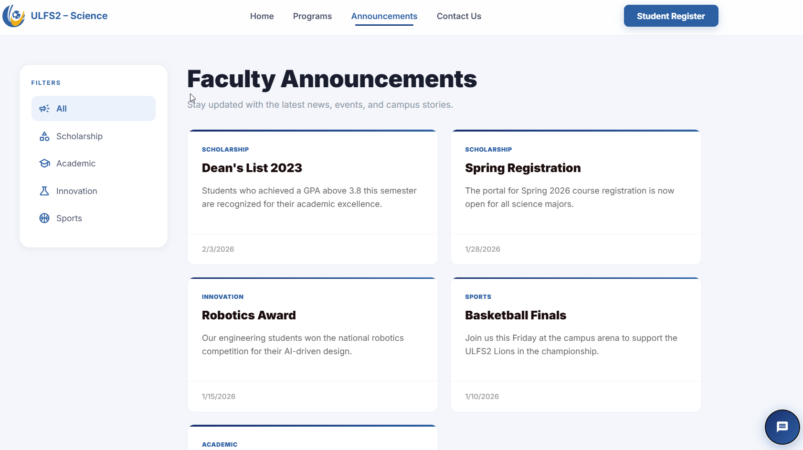

  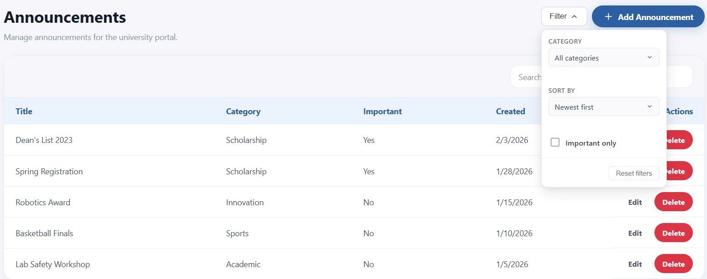

### Calendar

  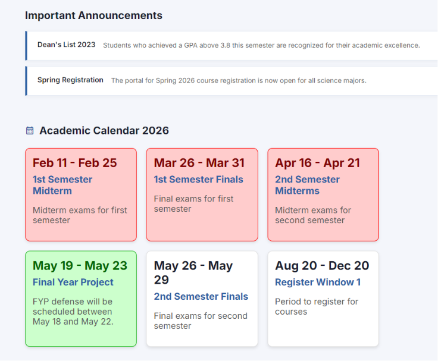

  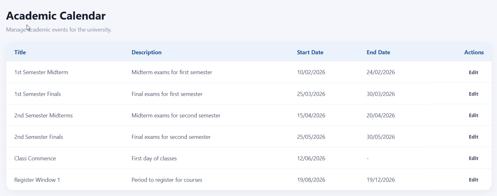

### Payments

  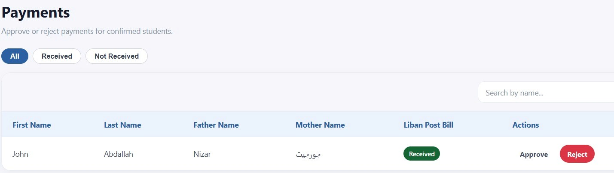

  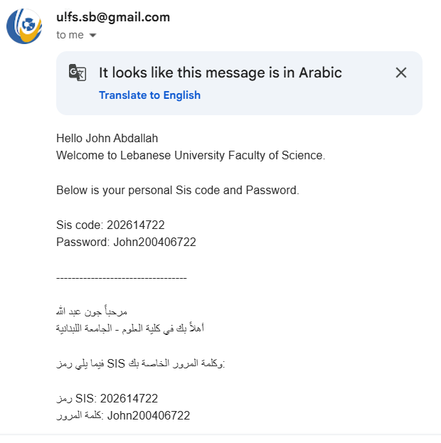

---

## 🔐 Authentication

  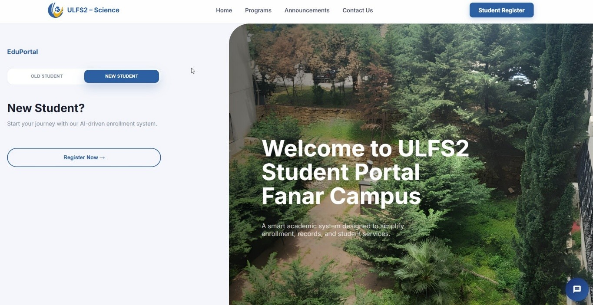

  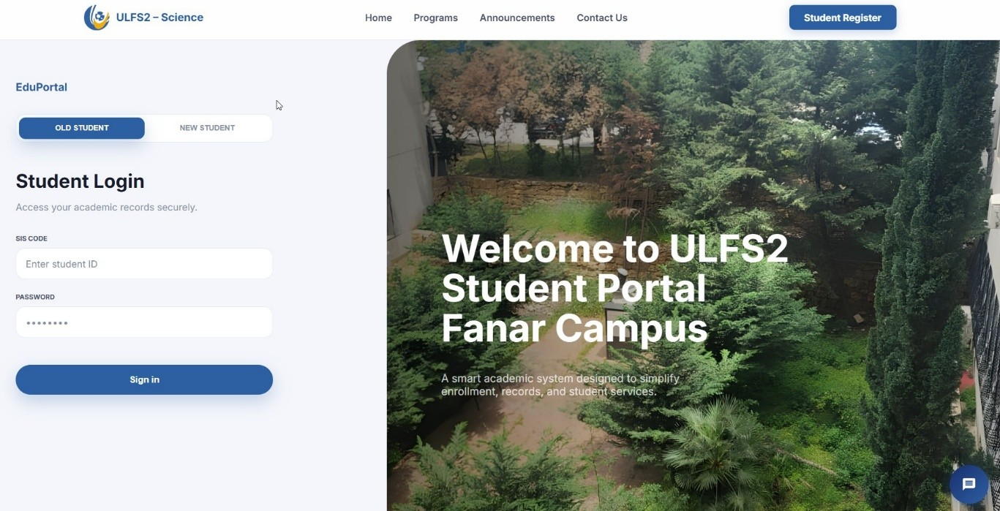

---

## 👨‍💻 Project Info

- Lebanese University – Faculty of Science (Fanar)
- Full-stack academic project
- Team: 2 developers
